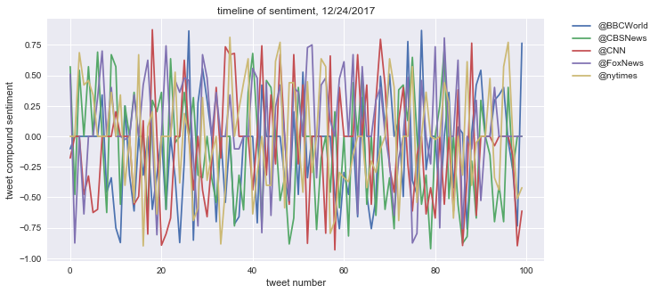
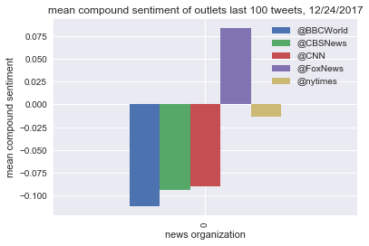
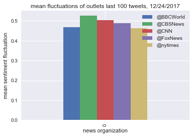

```python
# Dependencies
import tweepy
import json
import numpy as np
import matplotlib.pyplot as plotter
import pandas as pd
import seaborn as sas
sas.set()
import csv

# Import and Initialize Sentiment Analyzer
from vaderSentiment.vaderSentiment import SentimentIntensityAnalyzer
analyzer = SentimentIntensityAnalyzer()

with open('keys.csv') as csvfile:
    csvReader = csv.reader(csvfile)
    csvRow = next(csvReader)
    # Twitter API Keys
    consumer_key = csvRow[0]
    consumer_secret = csvRow[1]
    access_token = csvRow[2]
    access_token_secret = csvRow[3]
# Setup Tweepy API Authentication
auth = tweepy.OAuthHandler(consumer_key, consumer_secret)
auth.set_access_token(access_token, access_token_secret)
api = tweepy.API(auth)

```

###observations:
Fox news is only net-positive recently (if run again, is this a time-of-year thing?)
All of them seem to have a similar fluctuation of swinging back and forth.
A remarkable number of tweets hit multiple '~0' compound values in a row, far higher than I would expect.


```python

# Target User Accounts
#__BBC, CBS, CNN, Fox, and New York times__
# 
target_user = ("@BBCWorld", "@CBSNews", "@CNN", "@FoxNews", "@nytimes")

all_Sentiment=[]

# Loop through each user
for user in target_user:

    # Variables for holding sentiments
    current_compound_list = []
    current_positive_list = []
    current_negative_list = []
    current_neutral_list = []
    current_tweet_text=[]
    

    # Loop through 10 pages of tweets (total 200 tweets)
    for page in tweepy.Cursor(api.user_timeline, id=user).pages(5):

        # Get all tweets from home feed
        for tweetSet in page:
            tweet = json.dumps(tweetSet._json, indent=3)
            tweet = json.loads(tweet)
            text = tweet['text']

            # Run Vader Analysis on each tweet
            compound = analyzer.polarity_scores(text)["compound"]
            pos = analyzer.polarity_scores(text)["pos"]
            neu = analyzer.polarity_scores(text)["neu"]
            neg = analyzer.polarity_scores(text)["neg"]

            # Add each value to the appropriate array
            all_Sentiment.append([user,text,compound,pos,neg,neu])
            """
            current_compound_list.append(compound)
            current_positive_list.append(pos)
            current_negative_list.append(neg)
            current_neutral_list.append(neu)
            
            current_tweet_text.append(text)"""
    #all_Sentiment[user]=[current_compound_list,current_positive_list,current_negative_list,current_neutral_list,current_tweet_text]

    # Print the Averages for each user
    #print("")
    #print("User: %s" % user)
    #print("Compound: %s" % np.mean(positive_list))
    #print("Positive: %s" % np.mean(positive_list))
    #print("Neutral: %s" % np.mean(neutral_list))
    #print("Negative: %s" % np.mean(negative_list))

```


```python
twitter_frame = pd.DataFrame(all_Sentiment)
twitter_frame.to_csv('pulled_tweets.csv')
twitter_frame.head()
```


<div>
<style>
    .dataframe thead tr:only-child th {
        text-align: right;
    }

    .dataframe thead th {
        text-align: left;
    }

    .dataframe tbody tr th {
        vertical-align: top;
    }
</style>
<table border="1" class="dataframe">
  <thead>
    <tr style="text-align: right;">
      <th></th>
      <th>0</th>
      <th>1</th>
      <th>2</th>
      <th>3</th>
      <th>4</th>
      <th>5</th>
    </tr>
  </thead>
  <tbody>
    <tr>
      <th>0</th>
      <td>@BBCWorld</td>
      <td>Catalonia election: Spain's King Felipe warns ...</td>
      <td>-0.1027</td>
      <td>0.0</td>
      <td>0.167</td>
      <td>0.833</td>
    </tr>
    <tr>
      <th>1</th>
      <td>@BBCWorld</td>
      <td>Tunisia bans UAE Emirates airline from landing...</td>
      <td>0.0000</td>
      <td>0.0</td>
      <td>0.000</td>
      <td>1.000</td>
    </tr>
    <tr>
      <th>2</th>
      <td>@BBCWorld</td>
      <td>Skiers in French Alps lift ordeal at Chamrouss...</td>
      <td>0.0000</td>
      <td>0.0</td>
      <td>0.000</td>
      <td>1.000</td>
    </tr>
    <tr>
      <th>3</th>
      <td>@BBCWorld</td>
      <td>Bob Givens: Bugs Bunny animator dies aged 99 h...</td>
      <td>0.0000</td>
      <td>0.0</td>
      <td>0.000</td>
      <td>1.000</td>
    </tr>
    <tr>
      <th>4</th>
      <td>@BBCWorld</td>
      <td>World's largest amphibious aircraft takes flig...</td>
      <td>0.0000</td>
      <td>0.0</td>
      <td>0.000</td>
      <td>1.000</td>
    </tr>
  </tbody>
</table>
</div>


```python
sentiment_subsets=[[row[2] if row[0]==user else -2 for row in all_Sentiment]for user in target_user]
sentiment_subsets =[list(filter(lambda x: x!=-2,item)) for item in sentiment_subsets]
```


```python
sent_sub_tp = np.transpose(sentiment_subsets)
plotter.figure(figsize=(10,5))
for i,user in enumerate(target_user):
    plotter.plot(np.transpose(sentiment_subsets[i]),label = user)
plotter.title('timeline of sentiment, 12/24/2017')
plotter.xlabel('tweet number')
plotter.ylabel('tweet compound sentiment')
plotter.legend(bbox_to_anchor=(1.05, 1), loc=2, borderaxespad=0.)
plotter.savefig('timeline_of_sentiment.png')
plotter.show()
```





```python
sentiment_Totals = {}
for i, user in enumerate(target_user):
    sentiment_Totals[user]=[]
    sentiment_Totals[user].append(np.mean(sentiment_subsets[i]))
```


```python
pd.DataFrame(sentiment_Totals).plot(kind='bar')
plotter.title('mean compound sentiment of outlets last 100 tweets, 12/24/2017')
plotter.xlabel('news organization')
plotter.ylabel('mean compound sentiment')
plotter.savefig('aggregate sentiments.png')
plotter.show()
```





```python
difs = [[np.absolute(sentiment_subsets[i][j]-sentiment_subsets[i][j-1]) for j,item in enumerate(sentiment_subsets[i])] for i,user in enumerate(target_user)]
```


```python
sentiment_Fluxes = {}
for i, user in enumerate(target_user):
    sentiment_Fluxes[user]=[]
    sentiment_Fluxes[user].append(np.mean(difs[i]))
pd.DataFrame(sentiment_Fluxes).plot(kind='bar')
plotter.title('mean fluctuations of outlets last 100 tweets, 12/24/2017')
plotter.xlabel('news organization')
plotter.ylabel('mean sentiment fluctuation')
plotter.savefig('flux_sentiments.png')
plotter.show()
```





```python
difs
```


    [[0.0,
      0.0,
      0.0,
      0.0,
      0.0,
      0.0,
      0.0,
      0.0,
      0.0,
      0.0,
      0.0,
      0.0,
      0.0,
      0.0,
      0.0,
      0.0,
      0.0,
      0.0,
      0.0,
      0.0,
      0.0,
      0.0,
      0.0,
      0.0,
      0.0,
      0.0,
      0.0,
      0.0,
      0.0,
      0.0,
      0.0,
      0.0,
      0.0,
      0.0,
      0.0,
      0.0,
      0.0,
      0.0,
      0.0,
      0.0,
      0.0,
      0.0,
      0.0,
      0.0,
      0.0,
      0.0,
      0.0,
      0.0,
      0.0,
      0.0,
      0.0,
      0.0,
      0.0,
      0.0,
      0.0,
      0.0,
      0.0,
      0.0,
      0.0,
      0.0,
      0.0,
      0.0,
      0.0,
      0.0,
      0.0,
      0.0,
      0.0,
      0.0,
      0.0,
      0.0,
      0.0,
      0.0,
      0.0,
      0.0,
      0.0,
      0.0,
      0.0,
      0.0,
      0.0,
      0.0,
      0.0,
      0.0,
      0.0,
      0.0,
      0.0,
      0.0,
      0.0,
      0.0,
      0.0,
      0.0,
      0.0,
      0.0,
      0.0,
      0.0,
      0.0,
      0.0,
      0.0,
      0.0,
      0.0,
      0.0],
     [0.0,
      0.0,
      0.0,
      0.0,
      0.0,
      0.0,
      0.0,
      0.0,
      0.0,
      0.0,
      0.0,
      0.0,
      0.0,
      0.0,
      0.0,
      0.0,
      0.0,
      0.0,
      0.0,
      0.0,
      0.0,
      0.0,
      0.0,
      0.0,
      0.0,
      0.0,
      0.0,
      0.0,
      0.0,
      0.0,
      0.0,
      0.0,
      0.0,
      0.0,
      0.0,
      0.0,
      0.0,
      0.0,
      0.0,
      0.0,
      0.0,
      0.0,
      0.0,
      0.0,
      0.0,
      0.0,
      0.0,
      0.0,
      0.0,
      0.0,
      0.0,
      0.0,
      0.0,
      0.0,
      0.0,
      0.0,
      0.0,
      0.0,
      0.0,
      0.0,
      0.0,
      0.0,
      0.0,
      0.0,
      0.0,
      0.0,
      0.0,
      0.0,
      0.0,
      0.0,
      0.0,
      0.0,
      0.0,
      0.0,
      0.0,
      0.0,
      0.0,
      0.0,
      0.0,
      0.0,
      0.0,
      0.0,
      0.0,
      0.0,
      0.0,
      0.0,
      0.0,
      0.0,
      0.0,
      0.0,
      0.0,
      0.0,
      0.0,
      0.0,
      0.0,
      0.0,
      0.0,
      0.0,
      0.0,
      0.0],
     [0.0,
      0.0,
      0.0,
      0.0,
      0.0,
      0.0,
      0.0,
      0.0,
      0.0,
      0.0,
      0.0,
      0.0,
      0.0,
      0.0,
      0.0,
      0.0,
      0.0,
      0.0,
      0.0,
      0.0,
      0.0,
      0.0,
      0.0,
      0.0,
      0.0,
      0.0,
      0.0,
      0.0,
      0.0,
      0.0,
      0.0,
      0.0,
      0.0,
      0.0,
      0.0,
      0.0,
      0.0,
      0.0,
      0.0,
      0.0,
      0.0,
      0.0,
      0.0,
      0.0,
      0.0,
      0.0,
      0.0,
      0.0,
      0.0,
      0.0,
      0.0,
      0.0,
      0.0,
      0.0,
      0.0,
      0.0,
      0.0,
      0.0,
      0.0,
      0.0,
      0.0,
      0.0,
      0.0,
      0.0,
      0.0,
      0.0,
      0.0,
      0.0,
      0.0,
      0.0,
      0.0,
      0.0,
      0.0,
      0.0,
      0.0,
      0.0,
      0.0,
      0.0,
      0.0,
      0.0,
      0.0,
      0.0,
      0.0,
      0.0,
      0.0,
      0.0,
      0.0,
      0.0,
      0.0,
      0.0,
      0.0,
      0.0,
      0.0,
      0.0,
      0.0,
      0.0,
      0.0,
      0.0,
      0.0,
      0.0],
     [0.0,
      0.0,
      0.0,
      0.0,
      0.0,
      0.0,
      0.0,
      0.0,
      0.0,
      0.0,
      0.0,
      0.0,
      0.0,
      0.0,
      0.0,
      0.0,
      0.0,
      0.0,
      0.0,
      0.0,
      0.0,
      0.0,
      0.0,
      0.0,
      0.0,
      0.0,
      0.0,
      0.0,
      0.0,
      0.0,
      0.0,
      0.0,
      0.0,
      0.0,
      0.0,
      0.0,
      0.0,
      0.0,
      0.0,
      0.0,
      0.0,
      0.0,
      0.0,
      0.0,
      0.0,
      0.0,
      0.0,
      0.0,
      0.0,
      0.0,
      0.0,
      0.0,
      0.0,
      0.0,
      0.0,
      0.0,
      0.0,
      0.0,
      0.0,
      0.0,
      0.0,
      0.0,
      0.0,
      0.0,
      0.0,
      0.0,
      0.0,
      0.0,
      0.0,
      0.0,
      0.0,
      0.0,
      0.0,
      0.0,
      0.0,
      0.0,
      0.0,
      0.0,
      0.0,
      0.0,
      0.0,
      0.0,
      0.0,
      0.0,
      0.0,
      0.0,
      0.0,
      0.0,
      0.0,
      0.0,
      0.0,
      0.0,
      0.0,
      0.0,
      0.0,
      0.0,
      0.0,
      0.0,
      0.0,
      0.0],
     [0.0,
      0.0,
      0.0,
      0.0,
      0.0,
      0.0,
      0.0,
      0.0,
      0.0,
      0.0,
      0.0,
      0.0,
      0.0,
      0.0,
      0.0,
      0.0,
      0.0,
      0.0,
      0.0,
      0.0,
      0.0,
      0.0,
      0.0,
      0.0,
      0.0,
      0.0,
      0.0,
      0.0,
      0.0,
      0.0,
      0.0,
      0.0,
      0.0,
      0.0,
      0.0,
      0.0,
      0.0,
      0.0,
      0.0,
      0.0,
      0.0,
      0.0,
      0.0,
      0.0,
      0.0,
      0.0,
      0.0,
      0.0,
      0.0,
      0.0,
      0.0,
      0.0,
      0.0,
      0.0,
      0.0,
      0.0,
      0.0,
      0.0,
      0.0,
      0.0,
      0.0,
      0.0,
      0.0,
      0.0,
      0.0,
      0.0,
      0.0,
      0.0,
      0.0,
      0.0,
      0.0,
      0.0,
      0.0,
      0.0,
      0.0,
      0.0,
      0.0,
      0.0,
      0.0,
      0.0,
      0.0,
      0.0,
      0.0,
      0.0,
      0.0,
      0.0,
      0.0,
      0.0,
      0.0,
      0.0,
      0.0,
      0.0,
      0.0,
      0.0,
      0.0,
      0.0,
      0.0,
      0.0,
      0.0,
      0.0]]


